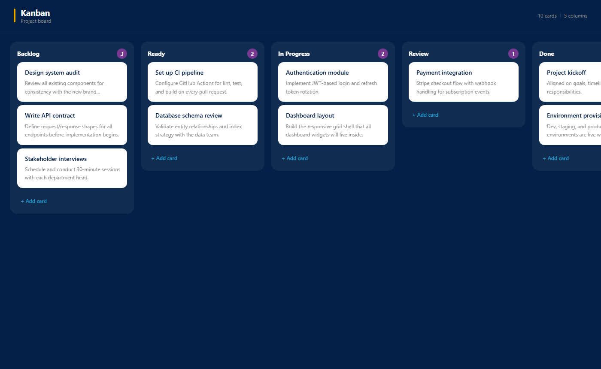

# Kanban

A single-board Kanban app for visual project management.


**Live demo: [kanban-nu-lake.vercel.app](https://kanban-nu-lake.vercel.app)**



---

## Features

- Drag and drop cards between columns
- Rename columns by double-clicking the header
- Add and delete cards with title and details
- Click any card to view its full details
- Starts with sample data — no setup required

## Stack

- Next.js 16, React 19, TypeScript
- Tailwind CSS 4
- @hello-pangea/dnd

## Run locally

```bash
cd frontend
npm install
npm run dev
```

Open http://localhost:3000
